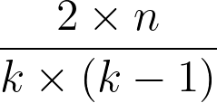
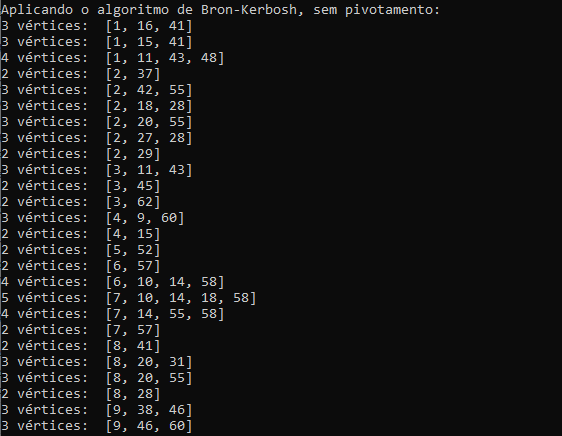
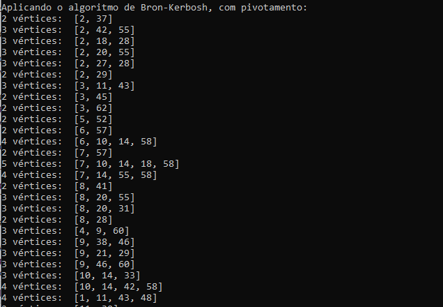
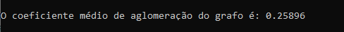

# P1 (TAG - 2021.1 - 202033202): Algoritmo de Bron-Kerbosh
Projeto 1 de Teoria e Aplicação de Grafos, disciplina ofertada na Universidade de Brasília (UnB) no semestre 2021.1.
Desenvolvido por Gabriel Mendes Ciriatico Guimarães, de matrícula 202033202.

## Objetivos do projeto

O objetivo principal é aplicar o algoritmo de Bron-Kerbosh para encontrar os cliques maximais de um grafo não-direcionado. O algoritmo é utilizado na forma sem pivotamento e com pivotamento. O programa também mostra o coeficiente médio de aglomeração do grafo dado.

O programa lê um arquivo .mtx, em que cada linha representa uma aresta entre dois vértices enumerados. Para o programa, é usado o arquivo soc-dolphins.mtx, montado a partir do artigo  “David Lusseau et al., The bottelenose dolphin community of Doubful Sound features a large proportion of long-lasting associations, Journal of Behavioral Ecology and Sociobiology 54:4, 396--405 (2003).” e disponibilizado pelo professor da disciplina, Díbio Leandro Borges.

Esse arquivo mapeia as relações estabelecidas entre 62 golfinhos em um grafo não direcionado.

## Algoritmo de Bron-Kerbosh

O algoritmo foi implementado utilizando um grafo representado por listas de adjacências. Como esse algoritmo geralmente é descrito em termos de conjuntos, as listas foram substituídas por sets em Python, permitindo fazer a tradução do pseudo código para código de uma forma direta.

### Algoritmo sem pivotamento

O pseudo código que serviu de base para a implementação do algoritmo de Bron-Kerbosh pode ser encontrado no <a href="https://iq.opengenus.org/bron-kerbosch-algorithm/">OpenGenus IQ</a> e podendo ser visto na abaixo:

<pre><code>   BronKerbosch1(R, P, X):
       se P e X estão ambos vazios:
           retorna R como clique maximal
       para cada vértice v em P:
           BronKerbosch1(R ⋃ {v}, P ⋂ N(v), X ⋂ N(v))
           P := P \ {v}
           X := X ⋃ {v}
</code></pre>

Na primeira iteração, portanto, temos os conjuntos R e X vazios, com P sendo a lista de todos os nós do grafo.

### Algoritmo com pivotamento

Para o algoritmo com pivotamento, foi utilizado pseudo código descrito em <a href="http://www.din.uem.br/sbpo/sbpo2011/pdf/87964.pdf">Brito e Santos (2011)</a>. O método de pivotamento escolhido foi o de grau máximo. Assim, cada iteração do algoritmo sem pivotamento agora recebe não passa para um vértice qualquer em P, e sim um pivô - no caso, o vértice de maior grau em P.

O pseudo código utilizado pode ser visto abaixo:

<pre><code>   BronKerbosch2(R, P, X):
       se P e X estão ambos vazios:
           retorna R como clique maximal
       para o pivô v em P, o vértice de maior grau:
           BronKerbosch2(R ⋃ {v}, P ⋂ N(v), X ⋂ N(v))
           P := P \ {v}
           X := X ⋃ {v}
</code></pre>

## Coeficiente médio de aglomeração

O coeficiente médio de aglomeração de um grafo é a média de todos os coeficientes locais de aglomeração. Este, por sua vez, descreve a relação entre a quantidade de vizinhos de um vértice que são vizinhos entre si e o grau desse mesmo vértice. O cálculo do coeficiente local pode ser visto abaixo:

<p align="center"></p>

Em que k é o grau do vértice v e n é o número de vizinhos de v que são vizinhos entre si.

## Compilação
Para utilizar o projeto desenvolvido, é necessário que o arquivo soc.dolphins.mtx esteja na mesma pasta do código .py. Caso queira utilizar-se um outro arquivo .mtx, é necessário alterar no código fonte.

Com isso, basta compilar o arquivo .py no terminal.

```console
python tag_p1_202033202.py
```

## Interface

A interface com o usuário é exibida através do terminal. Nele, quando o código é compilado, são exibidas três seções: cada clique máximo obtido pelo algoritmo sem pivotamento, com o total na linha final; cada clique máximo obtido pelo algoritmo com pivotamento, com o total na linha final; e o coeficiente máximo de aglomeração do grafo.

Nas figuras abaixos é possível ver capturas de tela de trechos cada uma dessas seções.

<p align="center"></p>

<p align="center"></p>

<p align="center"></p>


## License
[MIT](https://choosealicense.com/licenses/mit/)
